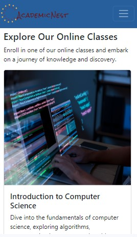

# Welcome to Academic Nest

This web application simulates a college website, offering students the choice between online and on-campus education. The project primarily focuses on creating an intuitive and visually appealing website layout. If you can't find links to classes, don't worry—it's intentional! 🙂

## Tech Stack
- **React.js**
- **Bootstrap 5**

<!-- Screenshots -->
## Screenshots

### Desktop View


### Mobile View


## Acknowledgments
- The icon and logo for this website were created using [Hatchful](https://www.shopify.com/tools/logo-maker/).
- Special thanks to [ChatGPT](https://chat.openai.com) for generating dummy text.

### Image Credits
- [Mind and Brain Illustration](https://pixabay.com/illustrations/mind-brain-mindset-perception-544404/)
- [Mathematics Background](https://pixabay.com/photos/math-work-mathematics-formulas-4711302/)
- [Art History Image](https://www.freepik.com/free-photo/blooming-floral-arts-crafts-nature_17129319.htm#query=art%20history%20online%20course&position=38&from_view=keyword&track=ais&uuid=e5a7afda-eca9-4a34-b788-8271f7ac7e1e)
- [Programming Background](https://www.freepik.com/free-photo/programming-background-with-person-working-with-codes-computer_38669459.htm#query=computer%20science&position=0&from_view=search&track=ais&uuid=87af6c86-5451-4100-a5d7-e414a9d7e3c4)
- [Students Studying Outdoors](https://www.freepik.com/free-photo/group-students-with-books-tablet-are-studying-outdoors-together-sitting-grass_2583681.htm#query=colleges%20orientation&position=2&from_view=keyword&track=ais&uuid=54550f0d-801e-490a-9153-b62aae296916)
- [Educating in Library](https://www.freepik.com/free-photo/boy-girl-educating-library_1363443.htm#query=student%20services&position=1&from_view=keyword&track=ais&uuid=dd8b966f-bfa1-4c94-9c82-d16f2768b500)
- [College Mates Studying Together](https://www.freepik.com/free-photo/college-mates-studying-together_16294771.htm#query=studying%20together&position=4&from_view=search&track=ais&uuid=1594d951-5495-41d9-b23b-2c397066a4a3)
- [Aerial Photography of Building](https://unsplash.com/photos/aerial-photography-green-and-white-concrete-building-kfwPJieZVwI)

## Contributing

You are interested in this project? Feel free to explore and contribute! If you have any suggestions or feedback, please let me know. 🚀

## How to Install and Launch the Project

### To Install the Project
```bash
gh repo clone merv-e/academic-nest
cd academic-nest
npm install
```
### To launch the project
`npm start`